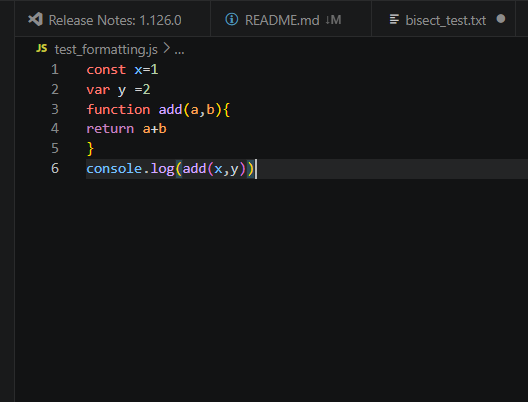
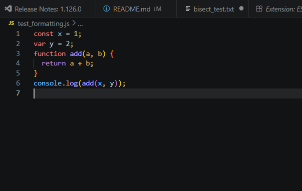

# Understanding Clean Code Principles

## Core Principles of Clean Code

### 1. Simplicity
Keep code as simple as possible — solve the problem in the most
straightforward way without adding unnecessary complexity. Simple code
is easier to test, debug, and maintain. If you find yourself writing
something clever, ask whether a simpler solution exists.

> "Make everything as simple as possible, but not simpler." — Albert Einstein

### 2. Readability
Code is read far more often than it is written. Readable code uses
meaningful variable and function names, clear structure, and logical
flow so that any developer (including your future self) can understand
it without needing the original author to explain it.

### 3. Maintainability
Maintainable code is structured so that future changes are easy to make
without breaking other parts of the system. This means avoiding tightly
coupled code, writing modular functions, and not relying on "magic"
numbers or undocumented assumptions that only the original author understands.

### 4. Consistency
Following consistent style guides, naming conventions, and patterns across
a codebase makes it feel like it was written by one person rather than many.
Consistency reduces cognitive load — once you learn the patterns in a
codebase, you can navigate and understand new parts quickly without relearning
different styles in different files.

### 5. Efficiency
Write performant, optimized code — but avoid premature optimization. Focus
first on making the code correct and readable, then optimize only the parts
that actually need it based on real performance data. Over-engineered
"optimizations" often reduce readability without measurable benefit.

---

## Example of Messy Code

```python
def c(a, b, l):
    x = []
    for i in range(len(l)):
        if l[i] > a and l[i] < b:
            x.append(l[i])
    r = 0
    for i in range(len(x)):
        r = r + x[i]
    if len(x) == 0:
        return 0
    return r / len(x)
```

### Why this is difficult to read
- **Meaningless names:** `c`, `a`, `b`, `l`, `x`, `r`, and `i` give no
  indication of what they represent. You have to trace the entire function
  just to understand what it does.
- **Manual index loops:** Using `range(len(l))` and accessing `l[i]` is
  unnecessarily verbose in Python — there are cleaner ways to iterate.
- **No docstring or comments:** There is no explanation of what the function
  does, what its parameters mean, or what it returns.
- **Logic split unnecessarily:** Filtering and summing are done in two
  separate loops when they could be combined more cleanly.
- **Poor structure:** The edge case (`len(x) == 0`) is handled at the end
  instead of being a clear guard clause at the top.

---

## Rewritten Clean Version

```python
def average_within_range(min_value: float, max_value: float, numbers: list) -> float:
    """
    Calculate the average of all numbers in a list that fall within
    a given range (exclusive of min and max boundaries).

    Args:
        min_value: The lower boundary (exclusive).
        max_value: The upper boundary (exclusive).
        numbers: A list of numeric values to filter and average.

    Returns:
        The average of the filtered numbers, or 0 if none fall in range.
    """
    values_in_range = [n for n in numbers if min_value < n < max_value]

    if not values_in_range:
        return 0

    return sum(values_in_range) / len(values_in_range)
```

### Why this is cleaner
- **Meaningful names:** `average_within_range`, `min_value`, `max_value`,
  `numbers`, and `values_in_range` all clearly describe what they represent.
- **Docstring:** The function's purpose, parameters, and return value are
  all documented.
- **List comprehension:** Filtering is done in one clean, readable line
  instead of a verbose loop.
- **Guard clause first:** The edge case is handled early and clearly before
  the main logic runs.
- **Type hints:** `float`, `list`, and `-> float` make the expected input
  and output types explicit without needing comments.
- **Built-in functions:** Using `sum()` and `len()` directly is more
  Pythonic and readable than manual accumulation.

---

## Key Takeaways
- Clean code is not about writing less code — it is about writing code
  that communicates its intent clearly
- Naming is one of the most powerful tools for readability — a well-named
  variable or function can eliminate the need for a comment entirely
- Consistency and simplicity together make a codebase feel professional
  and approachable, even to developers who are new to the project
- Maintainability is really about empathy — writing code that your future
  self or a teammate can work with confidently

  ---

## Code Formatting & Style Guides

### Research: Why is code formatting important?
Consistent code formatting makes a codebase feel unified and professional,
regardless of how many developers have worked on it. When everyone follows
the same style guide, code reviews become faster because reviewers can
focus on logic and functionality rather than debating whether to use single
or double quotes. Formatting tools like ESLint and Prettier remove
subjective style decisions entirely by enforcing rules automatically —
meaning developers never have to think about spacing or semicolons again,
they just write code and let the tools handle the rest.

The Airbnb JavaScript Style Guide is one of the most widely adopted style
guides in the industry. Key rules include:
- Use `const` by default, `let` when reassignment is needed, never `var`
- Always use semicolons
- Use single quotes for strings
- Use arrow functions for callbacks
- Always use strict equality (`===` instead of `==`)
- Use meaningful, descriptive variable names

### Tools Installed
- **ESLint** (by Microsoft) — installed via VS Code Extensions
- **Prettier - Code formatter** (by Prettier) — installed via VS Code Extensions

### Test File: Before Formatting
```javascript
const x=1
var y =2
function add(a,b){
return a+b
}
console.log(add(x,y))
```


### Test File: After Prettier & ESLint
```javascript
const x = 1;
const y = 2;
function add(a, b) {
  return a + b;
}
console.log(add(x, y));
```


### What issues did the linter and formatter detect?
- **Missing spaces** around operators (`x=1` → `x = 1`)
- **Missing semicolons** at the end of every statement
- **Missing spaces** after commas in function parameters (`add(a,b)` →
  `add(a, b)`)
- **Missing indentation** inside the function body
- **Use of `var`** — ESLint flagged this as a violation of the Airbnb
  style guide, suggesting `const` instead since `y` is never reassigned
- **Missing space** before the opening brace of the function (`){` → `) {`)

### Did formatting the code make it easier to read?
Yes — significantly. The before version looked rushed and inconsistent,
making it harder to scan quickly. The after version has clear, consistent
spacing, proper indentation, and explicit semicolons that make the
structure of the code immediately obvious. Even for a simple 6-line
function, the difference in readability was noticeable. In a larger
codebase with hundreds of files, consistent formatting like this would
make navigating and understanding unfamiliar code much faster.

### Key takeaway
Prettier handles formatting (spacing, semicolons, indentation) while ESLint
handles code quality (catching `var` usage, undefined variables, missing
returns). Used together, they act as an automated first line of code review
— catching style and quality issues before a human reviewer ever sees the
code. Setting these up early in a project saves significant time and
prevents style inconsistencies from accumulating over time.

---

## Naming Variables & Functions

### Research: Best Practices for Naming

**Variables:**
- Use descriptive, intention-revealing names (`userAge` not `a`)
- Use nouns for variables (`totalPrice`, `userName`, `isLoggedIn`)
- Boolean variables should read as yes/no questions (`isActive`,
  `hasPermission`, `canEdit`)
- Avoid abbreviations unless they are universally understood (`url`, `id`)
- Use camelCase for JavaScript variables and functions

**Functions:**
- Use verbs for functions since they perform actions (`calculateTotal`,
  `getUserData`, `sendEmail`)
- Function names should describe exactly what the function does —
  if you can't name it clearly, the function probably does too much
- Avoid vague names like `handle`, `process`, `doStuff`, or `update`
  without context

---

### ❌ Example of Poorly Named Code

```python
def proc(d, f, t):
    r = []
    for i in d:
        if i[f] == t:
            r.append(i)
    return r

data = [
    {"n": "Bhavya", "s": "active"},
    {"n": "Jeremy", "s": "inactive"},
    {"n": "Focus", "s": "active"},
]

res = proc(data, "s", "active")
print(res)
```

### Why this is poorly named
- `proc`, `d`, `f`, `t`, `r`, `i`, `n`, `s`, `res` — none of these
  reveal any intent or meaning
- You have to trace through the entire function and test data just to
  understand that it filters a list of users by a given field value
- `n` and `s` as dictionary keys are meaningless — what do they represent?
- If this code broke in production, debugging it would be painful because
  nothing is self-explanatory

---

### ✅ Refactored Clean Version

```python
def filter_records_by_field(records: list, field: str, target_value: str) -> list:
    """
    Filter a list of records, returning only those where the given
    field matches the target value.

    Args:
        records: List of dictionaries to filter.
        field: The dictionary key to filter by.
        target_value: The value to match against.

    Returns:
        A list of matching records.
    """
    return [record for record in records if record[field] == target_value]


users = [
    {"name": "Bhavya", "status": "active"},
    {"name": "Jeremy", "status": "inactive"},
    {"name": "Focus", "status": "active"},
]

active_users = filter_records_by_field(users, "status", "active")
print(active_users)
```

### How refactoring improved readability
- `filter_records_by_field` immediately tells you what the function does
  without reading a single line of its body
- `records`, `field`, and `target_value` clearly describe what each
  parameter represents
- `users` and `active_users` make the data's purpose obvious
- Dictionary keys `name` and `status` are self-documenting — no need
  to guess what `n` or `s` meant
- The list comprehension replaces the loop cleanly, and with meaningful
  variable names it reads almost like plain English:
  "return each record where record's field equals target value"

---

### 📝 Reflection

### What makes a good variable or function name?
A good name is specific, intention-revealing, and readable in context.
It should answer "what is this?" for a variable or "what does this do?"
for a function without requiring the reader to look elsewhere. The best
names make comments unnecessary — the code explains itself.

### What issues can arise from poorly named variables?
- **Debugging is slower** — you can't tell what a variable holds without
  tracing its entire history through the code
- **Onboarding takes longer** — new team members spend time decoding
  names instead of understanding logic
- **Bugs are harder to spot** — when nothing is named clearly, incorrect
  logic blends in with the surrounding noise
- **Refactoring is risky** — renaming `x` across a large codebase when
  you're not sure what `x` represents in every context is dangerous
- **Code reviews are slower** — reviewers have to understand the names
  before they can evaluate the logic

### How did refactoring improve readability?
The refactored version reads almost like a plain English description of
what the code does. `filter_records_by_field(users, "status", "active")`
explains itself completely — you know what goes in, what comes out, and
why, without reading the function body at all. The original version
required reading every line just to understand the basic concept.

---
