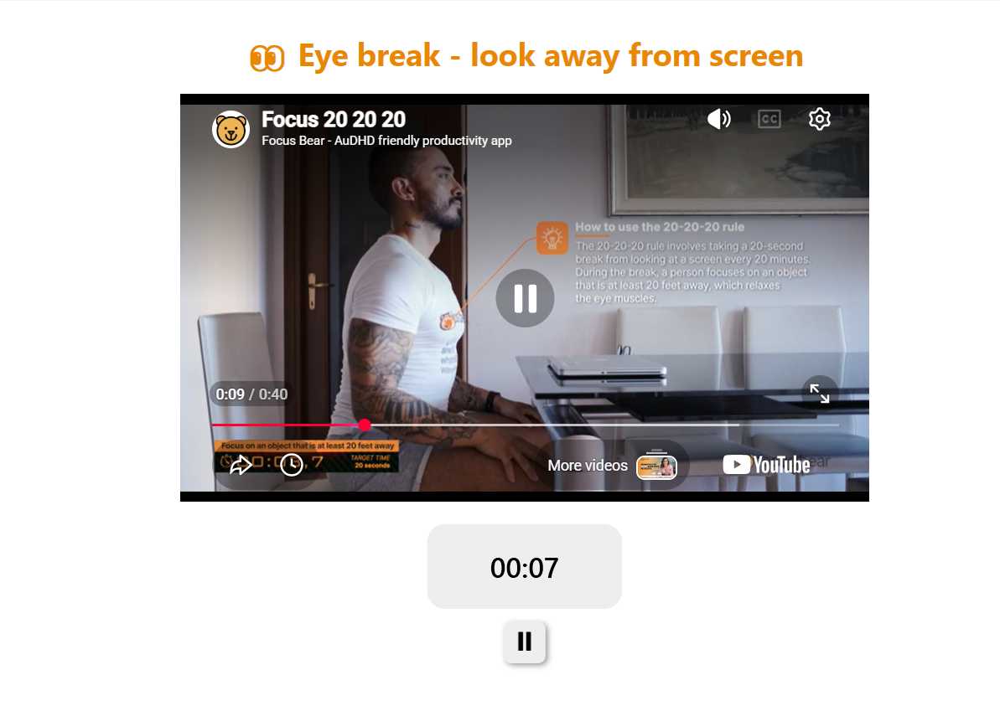
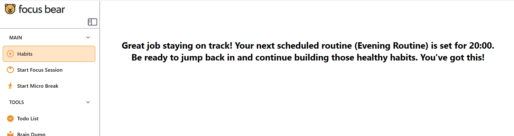

# First-Time User Experience - Focus Bear

## Overview
I downloaded and installed Focus Bear and went through the onboarding process
as a brand-new user with no prior knowledge of the app. Below are my detailed
observations, including what worked well and what could be improved.

---

## What Worked Well

### Welcome Screen & Bear Guide
The first screen you see when opening the app is visually appealing and
welcoming. The bear character that guides you through the main features is
a nice touch — it gives the app personality and makes navigation feel friendly
rather than overwhelming. For a new user, having a visual guide pointing to
key features immediately reduces confusion.

### Overall Onboarding Flow
The initial onboarding is manageable. While it takes a little getting used to,
once you are in the app and exploring, it starts to make sense. The learning
curve is not steep — you can get a hang of it fairly quickly.

---

## Areas for Improvement (5 Key Observations)

### 1. Habits Tab Shows No History After Completion
**What happened:** After completing my morning habits, the habits tab simply
displayed a message saying "You're all done for now — see you at your evening
routine." The completed habits completely disappeared from view.

**Why this is a problem:** As a new user, I could not remember exactly which
habits I had added to my routine. By the afternoon I was asking myself —
was it three habits or five? What did I actually do this morning? There is
no way to review what was completed without starting another session.

**Suggested improvement:** Show completed habits as a collapsed or scrollable
list with a green tick or strikethrough text so users can:
- Confirm what they completed
- Track their progress throughout the day
- Feel a sense of accomplishment from seeing everything ticked off

A simple dropdown for "Morning" and "Evening" showing completed habits with
green indicators would solve this completely.

---

### 2. Eye Break Video Plays During the Break — Defeating the Purpose
**What happened:** When I took a 20-second eye break (designed to make you
look away from the screen), a video immediately started playing on screen
demonstrating how to do the break.

**Why this is a problem:** The entire purpose of the eye break is to look
AWAY from the screen. But if a video starts playing the moment the timer
begins, the user is still looking at the screen for the duration of the
break. This completely defeats the point of the exercise, especially for
users relying on Focus Bear to protect their eye health and reduce screen
fatigue.

**Suggested improvement:** Play the instructional video BEFORE the timer
starts, not during it. The sequence should be:
1. Video plays explaining how to do the break (look 20 feet away, etc.)
2. Timer starts
3. Screen goes blank or shows a calming non-video visual (e.g. a simple
   countdown or plain colour) so the user can actually look away

---

### 3. Habits Added from Habit Pack Don't Appear Until App Restart
**What happened:** When I tried to add habits from the in-app habit pack,
the newly added habits did not show up in the habits tab immediately. I had
to close the app completely and reopen it before the habits appeared.

**Why this is a problem:** For a new user setting up the app for the first
time, this is confusing and feels like a bug. A user might think the habits
didn't save and add them again, resulting in duplicates. Or they might lose
trust in the app before they have even started using it properly.

**Suggested improvement:** Habits added from the habit pack should refresh
and appear in the habits tab immediately without requiring an app restart.
This is likely a simple sync or state refresh bug that should be prioritised
as it affects the very first experience of a new user.

---

### 4. Initial Onboarding Could Be Clearer
**What happened:** The onboarding process felt a little confusing at first,
particularly around understanding how habits, routines, and focus sessions
relate to each other.

**Why this is a problem:** Focus Bear has multiple interconnected features
(habits, morning routines, focus sessions, breaks) and it is not immediately
obvious how they all fit together. A new user might set things up incorrectly
and not realise until later.

**Suggested improvement:** A brief visual overview at the start of onboarding
showing how the app's features connect — for example, a simple diagram showing
"Morning Routine → Focus Sessions → Breaks → Evening Routine" — would help
users understand the system before diving into setup.

---

### 5. No Visible Summary of Today's Habits and Progress
**What happened:** There is no dashboard or summary view showing what habits
are planned for today, which have been completed, and what is still to come.

**Why this is a problem:** Users with ADHD in particular benefit from being
able to see their full day at a glance. Without a summary view, it is hard
to feel in control of the day or motivated to complete remaining habits.

**Suggested improvement:** A simple home screen summary showing:
- Morning habits: ✅ 3/3 completed
- Focus sessions: 2 completed today
- Evening habits: coming up at 7:00 PM

This would make the app feel much more complete and give users a satisfying
sense of progress throughout the day.

---

## Improvement Ideas Submitted to Form
1. Show completed habits as a reviewable checklist with green ticks after
   the morning routine ends, rather than hiding them entirely.
2. Move the eye break instructional video to BEFORE the timer starts so
   users can actually look away from the screen during the break itself.

---

## Overall Impression
Focus Bear has a warm, friendly design and a genuinely useful concept. The
bear guide is charming and the onboarding is manageable once you get into it.
However, the habits disappearing after completion, the eye break video timing
issue, and the habit pack sync bug all create friction in the very first
experience — which is the most important experience to get right for user
retention. With some targeted fixes, the onboarding could feel much more
polished and confidence-inspiring for new users.
