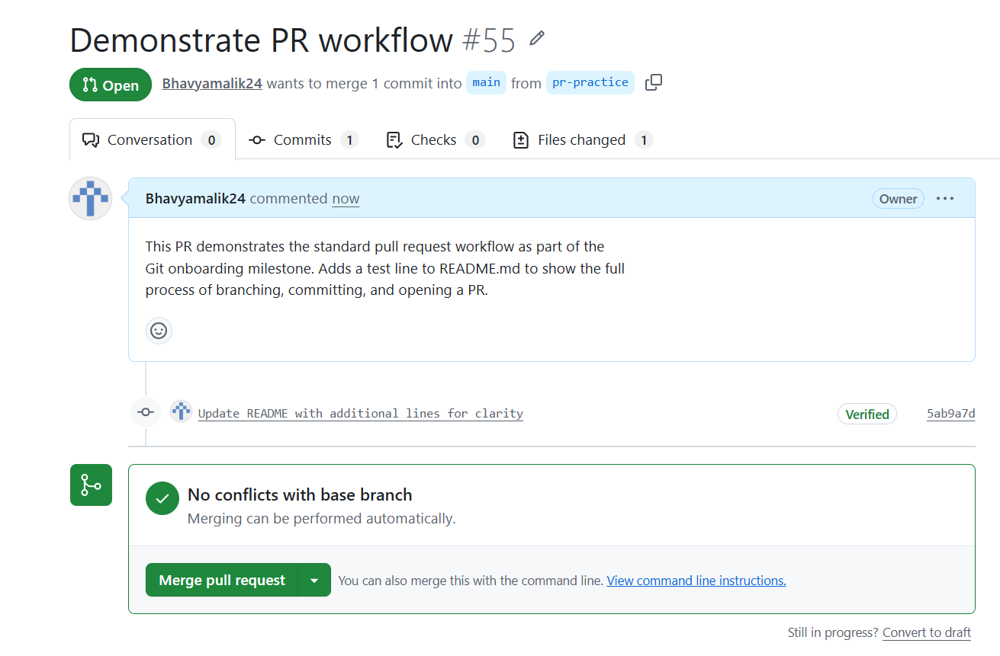

# Git Merge Conflicts - Understanding & Resolution

## What is a Merge Conflict?
A merge conflict happens when two branches have made different changes to the
same part of the same file, and Git cannot automatically decide which version
to keep. Git stops the merge and asks the developer to manually resolve the
conflict before continuing.

---

## How I Created a Merge Conflict

### Step 1: Created a new branch
Created a branch called `test-conflict` from main in my GitHub repo.

### Step 2: Edited a file on the branch
Edited `README.md` on the `test-conflict` branch by adding a line:

    ### This line was added on the test-conflict branch

Committed the change to the `test-conflict` branch.

### Step 3: Edited the same file on main
Switched back to the `main` branch and edited the same line in `README.md`
with different content:

    # Bhavya-intern-repo

Committed that change to main.

### Step 4: Created a Pull Request
Created a pull request on GitHub to merge `test-conflict` into `main`.
GitHub detected that both branches had conflicting changes to the same
part of `README.md` and flagged it with:

> "This branch has conflicts that must be resolved"

### Step 5: Resolved the conflict
Clicked "Resolve conflicts" in GitHub's web editor. The conflict appeared
in the file like this:

    <<<<<<< main
    # Bhavya-intern-repo
    =======
    ### This line was added on the test-conflict branch
    >>>>>>> test-conflict

- Everything between <<<<<<< main and ======= was the main branch version
- Everything between ======= and >>>>>>> test-conflict was the branch version
- I kept the main branch version and deleted the conflict markers
- Clicked "Mark as resolved" → "Commit merge" → "Merge pull request"

### Step 6: Deleted the branch
After merging, deleted the `test-conflict` branch to keep the repo clean.

---

## What I Learned

### What caused the conflict?
The conflict was caused by editing the same line in the same file on two
different branches. When Git tried to merge them, it had no way of knowing
which version was correct — so it flagged it for manual review. This would
happen in a real team when two developers work on the same file at the same
time without coordinating.

### How did I resolve it?
I used GitHub's built-in web conflict editor to view both versions side by
side. I chose to keep the main branch version as it was the most recent
intentional change, then removed the conflict markers and committed the
resolution.

### Key takeaways
- Merge conflicts are normal and not something to be afraid of
- They happen when two branches edit the same part of the same file
- Always read both versions carefully before deciding which to keep —
  sometimes you need to combine parts of both rather than choosing one
- Good communication in a team reduces conflicts — if two people know
  they are working on the same file, they can coordinate to avoid this
- Deleting branches after merging keeps the repo clean and organised
- In a real project, I would discuss with my teammate before overwriting
  their changes

---

## 1. Staging vs Committing

### What is Staging?
Staging is the process of telling Git which changes you want to include in
your next commit. When you modify a file, Git sees it as "modified" but does
not automatically include it in the next commit. You have to explicitly stage
it using `git add <file>` or the equivalent in your Git client.

Think of staging as putting items into a box before sealing it. You can
add and remove items from the box as many times as you want before you
finally seal it (commit).

### What is Committing?
Committing is the process of permanently saving the staged changes as a
snapshot in the Git history. Once committed, that snapshot is part of the
repo's history and can always be referred back to. A commit is like sealing
the box and labelling it with a description of what's inside.

### Experiment
1. Modified `README.md` by adding a new line. `git status` showed it as
   "Changes not staged for commit."
2. Ran `git add README.md`. `git status` then showed it as "Changes to be
   committed" — the file was now staged but not yet saved to history.
3. Ran `git reset HEAD README.md` to unstage it. The file went back to
   "modified but not staged" — the change was still there, just no longer
   queued for commit.
4. Staged it again and ran `git commit -m "Update README with new line"`.
   `git status` then showed "nothing to commit, working tree clean" —
   the change was now permanently saved in history.

### Difference between staging and committing

| | Staging | Committing |
|---|---|---|
| What it does | Marks changes to include in next commit | Permanently saves staged changes to history |
| Reversible? | Yes — easy to unstage | Yes but more complex to undo |
| Git command | `git add <file>` | `git commit -m "message"` |
| Analogy | Putting items in a box | Sealing and labelling the box |

### Why does Git separate these two steps?
Git separates staging and committing to give developers precise control
over what goes into each commit. Without a staging area, every modified
file would automatically be included in the next commit — which is often
not what you want. For example, if you are fixing a bug and accidentally
modify two files — one related to the fix and one you were just
experimenting with — staging lets you commit only the relevant file and
leave the other out. This keeps commit history clean, focused, and meaningful.

### When would you want to stage without committing?
- When you have changed multiple files but only want to commit some of them
- When you want to review exactly what will be committed before finalising
- When you are grouping related changes together before committing them
  as one logical unit
- When you want to pause mid-task, stage what is done, and continue working
  before making the final commit
- When collaborating — staging lets you prepare a clean, focused commit
  that is easy for teammates to review

### Key takeaway
The staging area gives a buffer between making changes and saving them
permanently. It encourages thoughtful, well-organised commits rather than
messy snapshots of half-finished work.

---

## 2. Branching & Team Collaboration

### Hands-on Experiment
1. Created a new branch called `branch-test` from `main`.
2. Made a small change to `README.md` on `branch-test` and committed it.
3. Switched back to `main` and checked the file — the change was **not**
   present on `main`. This confirmed that a branch is an isolated copy of
   the code, and changes only affect `main` once they are explicitly merged.

### Why is pushing directly to main problematic?
`main` is the stable, shared version of the codebase that the whole team
relies on. Pushing directly to it skips any review process, meaning bugs,
broken code, or incomplete work can go live immediately and affect everyone
working from `main` — including production systems if the app is deployed
from it. It removes the safety net of having a second person check the
change before it becomes part of the official codebase. In a real project,
I would never push straight to main — every change should go through a
branch and a Pull Request first.

### How do branches help with reviewing code?
Branches let a developer work in isolation without affecting `main`. Once
the work is ready, it can be opened as a Pull Request, where teammates review
the actual changes, leave comments, request edits, and run tests before
anything is merged. This turns development into a collaborative,
quality-checked process rather than a single person pushing unreviewed
changes straight to the live codebase.

### What happens if two people edit the same file on different branches?
If they edit different parts of the file, Git can usually merge both sets
of changes automatically with no issues. But if they edit the exact same
lines, Git cannot automatically decide which version is correct, and a
merge conflict occurs. Git pauses the merge and requires a person to
manually review both versions and decide what the final content should be.

### Key takeaway
Branches exist to protect the stability of `main` while still allowing
multiple people to work simultaneously without stepping on each other's
toes. The combination of branching, pull requests, and code review is what
makes collaborative software development possible at scale — without it,
every change would be a gamble.

---

## 3. Merge Conflicts & Conflict Resolution

### What is a Merge Conflict?
A merge conflict happens when two branches have made different changes to
the same part of the same file, and Git cannot automatically decide which
version to keep. Git stops the merge and asks the developer to manually
resolve the conflict before continuing.

### How I Created and Resolved a Merge Conflict
1. Created a branch called `test-conflict` from `main`.
2. Edited `README.md` on `test-conflict`, adding the line:
   `### This line was added on the test-conflict branch`. Committed it.
3. Switched back to `main` and edited the same line in `README.md` with
   different content: `# Bhavya-intern-repo`. Committed that to main.
4. Created a Pull Request to merge `test-conflict` into `main`. GitHub
   detected the conflict and flagged it: "This branch has conflicts that
   must be resolved."
5. Clicked "Resolve conflicts" in GitHub's web editor. The conflict appeared as:

```
<<<<<<< main
# Bhavya-intern-repo
=======
### This line was added on the test-conflict branch
>>>>>>> test-conflict
```

6. I kept the main branch version, deleted the conflict markers, clicked
   "Mark as resolved" → "Commit merge" → "Merge pull request."
7. Deleted the `test-conflict` branch afterwards to keep the repo clean.

### What caused the conflict?
Editing the same line in the same file on two different branches. When Git
tried to merge them, it had no way of knowing which version was correct —
so it flagged it for manual review.

### How did I resolve it?
Using GitHub's built-in web conflict editor, I compared both versions side
by side, chose to keep the main branch version as the intentional final
change, removed the conflict markers, and committed the resolution.

### Key takeaways
- Merge conflicts are normal and not something to be afraid of
- They happen when two branches edit the same part of the same file
- Always read both versions carefully before deciding which to keep —
  sometimes you need to combine parts of both rather than choosing one
- Good communication in a team reduces conflicts
- Deleting branches after merging keeps the repo clean and organised

---

## 4. Advanced Git Commands & When to Use Them

### `git log`
**What it does:** Shows the commit history of the repo — each commit's hash,
author, date, and message. `git log --oneline` gives a compact view.

**What I observed:** Running this in my repo showed a clear list of recent
commits with short messages, giving a quick overview of what changed and when.

**When to use it:** Essential for understanding project history, tracking
down when a bug was introduced, or reviewing what a teammate changed. In
long-running projects with multiple developers, `git log` is often the
first command used to understand context before making any change.

### `git blame <file>`
**What it does:** Shows, line by line, who last modified each line of a
file and in which commit.

**What I observed:** Running `git blame README.md` showed each line
annotated with the commit hash and author responsible for it.

**When to use it:** Useful in a team setting when you find a bug or
confusing code and want to know who wrote it and why — so you can ask
them directly or understand the context of the original commit message.

### `git checkout main -- <file>`
**What it does:** Restores a specific file back to its state on `main`,
discarding local uncommitted changes to that file only — without affecting
any other files you may have changed.

**What I observed:** I added a test line to `README.md`, confirmed it was
modified with `git status`, then ran `git checkout main -- README.md`. The
test line was removed and the file reverted to the clean main version,
while other unrelated changes remained untouched.

**When to use it:** Useful when you've made unwanted or experimental
changes to one file and want to discard just that file without losing
other work in progress.

### `git cherry-pick <commit>`
**What it does:** Applies one specific commit from another branch onto
your current branch, without merging the entire branch and all its other commits.

**How I tested it:**
1. Created a branch called `cherry-test` and switched to it.
2. Edited `README.md`, adding the line "This line is for cherry-pick
   testing," and committed it — commit hash `5cb79c0`.
3. Switched back to `main` with `git checkout main`.
4. Ran `git cherry-pick 5cb79c0`.
5. Git applied that exact commit onto `main` as a new commit (`be45e81`),
   without bringing in anything else from the `cherry-test` branch.
6. Pushed the change to GitHub and force-deleted the `cherry-test` branch
   with `git branch -D cherry-test` (a normal delete was blocked since the
   branch wasn't "merged" in the traditional sense — cherry-pick creates a
   copy of the commit rather than a merge).

**When to use it:** Very useful in long-running projects with multiple
developers — for example, if a critical bug fix was committed on a feature
branch that isn't ready to be merged yet, cherry-pick lets you pull just
that fix onto `main` immediately without bringing in unfinished work from
the rest of the branch.

### What surprised me while testing these commands?
I was surprised by how precise Git's commands are — each one solves a
narrow, specific problem rather than being a general-purpose tool.
`git checkout -- file` only touches one file, `git blame` only shows
attribution, and `git log` only shows history. I was also surprised that
cherry-pick creates a brand new commit (with a new hash) on the target
branch rather than literally moving the original commit — which is why
Git considered the source branch "not fully merged" even after the
content had been applied to main.

### Why these commands matter in long-running, multi-developer projects
- `git log` helps you understand the story of the project
- `git blame` helps you find who to ask about a confusing piece of code
- `git checkout -- file` lets you safely undo mistakes without losing
  unrelated work
- `git cherry-pick` lets you move urgent fixes between branches without
  disrupting larger, unfinished work

Together, these commands give developers precision and confidence when
working in complex, shared codebases — rather than relying on broad,
risky actions like deleting and starting over.lex, shared codebases — rather than relying on broad,
risky actions like deleting and starting over.

---

## Writing Meaningful Commit Messages

### Research: Good vs Bad Commit Messages
Looking at commit histories in large open-source projects like React and
Node.js, a clear pattern emerges. Good commits follow a structure: a short,
specific summary line (under ~50 characters) written in the imperative mood
("Fix memory leak in useEffect" not "Fixed a memory leak"), often followed
by a blank line and more detail if needed explaining *why* the change was
made, not just *what* changed. Bad commits tend to be vague single words
like "fix", "update", or "wip" that give no indication of what actually
changed without opening the diff.

### My Three Test Commits

**1. Vague commit message**

    fixed stuff

This tells a reader nothing. What was fixed? Why? Six months from now,
even I wouldn't remember what this referred to.

**2. Overly detailed commit message**

    Updated the README.md file to include a new line of text at the bottom 
    of the file because I wanted to test out different commit message styles 
    for the Focus Bear Git onboarding task about writing meaningful commit 
    messages and how they help teams

This is too long for a summary line — it reads like a paragraph rather
than a commit message. Important information is buried, and it would be
hard to scan quickly in a `git log` view.

**3. Well-structured commit message**

    Add test line to README for commit message exercise

This is short, specific, in the imperative mood, and immediately tells
a reader what changed and why — without needing to open the diff.

---

### What makes a good commit message?
- A short summary line (ideally under 50 characters) written in the
  imperative mood, e.g. "Fix login bug" not "Fixed login bug" or
  "Fixes login bug"
- Specific enough that someone scanning the log understands what changed
  without opening the diff
- If more context is needed, a blank line followed by a longer explanation
  of *why* the change was made, not just what
- No vague filler words like "stuff", "things", "misc", or "wip" without context

### How does a clear commit message help in team collaboration?
A clear commit history acts as a readable changelog of the project's
evolution. When a teammate runs `git log`, they should be able to
understand what happened and why without needing to ask the original
author. This is especially valuable when debugging — if a bug appears,
`git log` and `git blame` become genuinely useful tools for finding the
relevant change, but only if the messages are meaningful. It also makes
code review faster, since reviewers can understand the intent of a PR
just from its commit messages.

### How can poor commit messages cause issues later?
- They make `git log` and `git blame` far less useful for debugging,
  since you can't tell what a commit did without inspecting the full diff
- They slow down code reviews, since reviewers have to guess intent
- They make it hard to write release notes or changelogs from commit history
- In a long-running project, vague messages compound over time, turning
  the commit history into a list of meaningless entries rather than a
  useful record of the project's evolution
- They make tools like `git bisect` harder to use effectively, since you
  can't quickly judge which commit might be responsible for a bug based
  on its message alone

  ---

  ## Creating & Reviewing Pull Requests

### What is a Pull Request and why is it used?
A Pull Request (PR) is a formal request to merge changes from one branch
into another (usually into `main`). It is the standard way developers
propose changes in a team setting — instead of pushing directly, you open
a PR so teammates can review the actual code changes, leave comments,
request edits, and approve before anything becomes part of the shared codebase.

### Hands-on Experiment
1. Created a new branch called `pr-practice` from `main` on GitHub.
2. Edited `README.md` on that branch, adding the line
   "This branch demonstrates the PR workflow," and committed it directly
   to the branch.
3. Opened a Pull Request titled "Demonstrate PR workflow for Git onboarding"
   with a description explaining the purpose of the PR.
4. Reviewed the PR — checked the file diff to confirm only the intended
   change was included.
5. Merged the PR using "Merge pull request" → "Confirm merge."
6. Deleted the `pr-practice` branch afterwards to keep the repo clean.

### Reviewing an open-source PR
I looked through merged Pull Requests on the React repository
(github.com/facebook/react/pulls). I noticed that well-structured PRs
typically include a clear title describing the change, a description
explaining the motivation and what was changed, and often a checklist or
testing notes. Comments on PRs tended to focus on specific lines of code,
asking clarifying questions or requesting small adjustments before
approval. Reviewers often left a brief explanation when requesting changes
rather than just rejecting outright, which made the back-and-forth
collaborative rather than confrontational.

---

### Why are PRs important in a team workflow?
PRs create a structured review step before code becomes part of the shared
codebase. They prevent unreviewed or broken code from reaching `main`,
give teammates visibility into what is changing and why, and create a
permanent, searchable record of every change along with the discussion
that led to it. They also make it easy to run automated tests against
proposed changes before they are merged.

### What makes a well-structured PR?
- A clear, specific title that summarises the change
- A description explaining what changed and why, not just what
- Small, focused changes rather than huge, sprawling PRs that are hard to review
- Linking to a related issue when applicable, so the context is connected
- Clean commit history within the PR (meaningful commit messages, not "fix" x10)

### What did I learn from reviewing an open-source PR?
I learned that good PRs tell a story — the title and description alone
should give a reviewer enough context to understand the change before
even opening the diff. I also learned that code review is genuinely
collaborative rather than just approval or rejection; reviewers often
ask questions or suggest alternatives rather than simply blocking a PR.
This showed me that PRs are as much a communication tool as they are a
technical mechanism for merging code.



---
